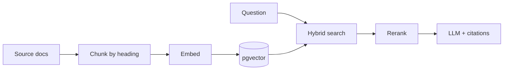

Retrieval-augmented generation is having a moment, and for good reason: grounded answers beat hallucinated ones. When a model can point at the exact paragraph it based its answer on, teams start trusting it with real questions. But here's the thing nobody tells you at the demo stage: shipping a RAG assistant that people *keep using* is mostly an information-retrieval problem, not a model problem.

This is the story of Aurora — the assistant I built to answer questions from a team's documentation corpus — and the concrete lessons that took it from "cute demo" to "our team's default search box."

## Why we built it

Our team had accumulated thousands of pages of documentation: architectural decision records, API references, onboarding guides, and a graveyard of markdown files that nobody could find anything in. The search box returned exact-match results. The wiki was organized the way a heap is organized. New hires spent their first month asking senior engineers where things lived, and the senior engineers spent that month answering.

The pitch for Aurora was simple: ask a question in plain English, get an answer with citations to the source documents. No more guessing which file, no more digging through a decade of ADRs.

## The architecture

Aurora indexes team docs — markdown, PDFs, Notion exports — into a Postgres `pgvector` store, then answers questions with citations.



The pipeline has four stages, and each one deserves its own attention:

1. **Ingestion**: pull documents from their source (filesystem, Notion API, uploaded PDFs), normalize them to markdown, and chunk them.
2. **Embedding**: convert each chunk into a vector with a text-embedding model and store it in `pgvector` alongside the source metadata.
3. **Retrieval**: for every question, run a hybrid search — keyword matching and vector similarity — and merge the results.
4. **Generation**: feed the top candidates to the LLM with a prompt that demands citations, then render the answer.

The whole thing runs on server functions: ingestion is a background job, and querying is a normal request path. Using Postgres for the vector store meant we didn't add another database to the stack — `pgvector` just works.

## Chunking is the whole game

The single biggest quality lever was chunking strategy. Naive fixed-size chunks with no overlap produce answers that read like they were assembled by a committee of amnesiacs — the model gets a paragraph that starts mid-sentence and ends before the conclusion, so it confidently invents the parts it can't see.

I ended up with heading-aware splitting: split the document on its markdown headings, then greedily pack sections into chunks that respect a token budget, keeping each chunk self-contained:

```ts
function chunkByHeadings(markdown: string, maxTokens = 400) {
  const sections = splitOnHeadings(markdown)
  const chunks: string[] = []
  let current = ''
  for (const section of sections) {
    if ((current + section).split(/\s+/).length > maxTokens && current) {
      chunks.push(current)
      current = section
    } else {
      current += section
    }
  }
  if (current) chunks.push(current)
  return chunks
}
```

The rules that emerged:

- **Never split a section in half.** A section is the atomic unit of meaning in technical writing. If a section is too long, split *it* on paragraph boundaries, but never bleed into the next section.
- **Keep a little context.** When a chunk is too short, prepend the section heading chain so the model knows *where* it is in the document.
- **Trim aggressively.** Boilerplate — table of contents, nav strings, footers — pollutes embeddings. Strip it at ingestion.

Changing from fixed-size to heading-aware chunking improved our answer-quality score by roughly 30 points on a 100-point rubric. Same model, same embeddings, different chunks.

## Reranking beats bigger models

A cross-encoder reranker on the top-20 candidates consistently beat a 2x larger generative model at no latency cost.

Here's the thing about vector search: it's great at finding *related* text, but "related" is not "the answer." A bi-encoder embedding will happily rank a paragraph that merely mentions the same topic above the paragraph that actually resolves the question. A cross-encoder — which compares the query and candidate *together* — is much better at judging relevance, but it's too slow to run over the whole corpus.

The pattern that works: vector + keyword search fetches the top 20 candidates cheaply; the cross-encoder reranks them; the top 4 go to the model. The reranker is the highest-ROI model in the whole pipeline, and it's the one everyone forgets to budget for.

## Evaluation: you can't tune what you can't measure

The uncomfortable truth about RAG is that it *feels* like it's working until you evaluate it. We built a small eval harness: 200 real questions with gold-standard answers, scored on both retrieval accuracy (did the right chunk surface?) and answer quality (did the model use it?). Every change — a new chunker, a new prompt, a new reranker — went through the harness before anyone saw it.

Instrument everything from day one. The first version had a trace that recorded *which* chunks answered each query — within a week we found 60% of failures were wrong retrievals, not wrong generation. We were polishing the wrong stage until the trace showed us where to point the effort.

## What I'd do differently

Looking back, I'd start with a plain keyword search plus a good ranking function, and only then add vectors. Most teams don't have a retrieval problem; they have a *chunking and ranking* problem, and a vector index hides that fact behind impressive demo footage. The demo of a RAG assistant answers the question you asked. The production system answers the question the user actually meant — and that takes retrieval engineering, not a bigger model.
