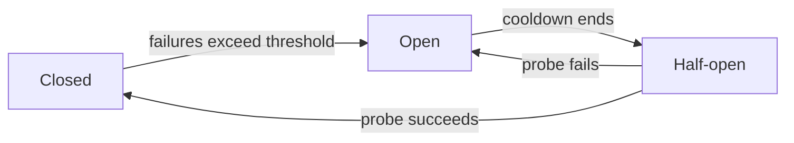

An outage rarely starts where the users are looking. A recommendations service gets slow. Every order-page request now waits on it for 30 seconds before timing out. Your thread pool or connection pool fills with requests that are all waiting on the same dead dependency, and now the whole order page fails, including the parts that never needed recommendations. The outage spreads backwards through every caller, one hop at a time.

Timeouts alone don't fix this. A 30-second timeout on every request to a dead service still means 30 seconds of occupied resources per request, at full traffic. What you need is to stop asking for a while after repeated failures. That's a circuit breaker.

## Three states

A circuit breaker wraps calls to one dependency and tracks failures.

**Closed.** Normal operation. Calls pass through, failures are counted. Under a threshold, nothing changes.

**Open.** The threshold tripped, say 5 consecutive failures. Every call fails immediately without touching the network. No timeout, no retry, no occupied connections. The caller gets an error in microseconds, or better, a fallback.

**Half-open.** After a cooldown, the breaker lets one real request through as a probe. It succeeds, the dependency is back: close the circuit, resume normally. It fails: back to open, cooldown restarts.



The name is honest: it's the breaker panel in your house. Fault trips the circuit, everything downstream of the fault stops being asked, and you flip it back on when the fault clears.

## A minimal implementation

```ts
type State = "closed" | "open" | "half-open";

export class CircuitBreaker {
  private state: State = "closed";
  private failures = 0;
  private openedAt = 0;

  constructor(
    private readonly threshold = 5,
    private readonly cooldownMs = 30_000,
  ) {}

  async exec<T>(fn: () => Promise<T>, fallback?: () => Promise<T>): Promise<T> {
    if (this.state === "open") {
      if (Date.now() - this.openedAt < this.cooldownMs) {
        return fallback ? fallback() : Promise.reject(new Error("circuit open"));
      }
      this.state = "half-open";
    }

    try {
      const result = await fn();
      this.failures = 0;
      this.state = "closed";
      return result;
    } catch (err) {
      this.failures++;
      if (this.state === "half-open" || this.failures >= this.threshold) {
        this.state = "open";
        this.openedAt = Date.now();
      }
      if (fallback) return fallback();
      throw err;
    }
  }
}
```

Usage:

```ts
const recs = new CircuitBreaker(5, 30_000);

const recommendations = await recs.exec(
  () => fetch("http://recs.internal/api/slots").then(r => r.json()),
  async () => [], // fallback: page renders without the recommendations row
);
```

Note what the fallback buys you. With one, a dead recommendations service degrades the page. Without one, it breaks it. That choice, not the state machine, is usually the difference users notice.

## What counts as a failure

Not every error should trip the breaker. A 400 from the recommendations API is a bug in your request, and retrying or breaking the circuit won't fix it. Count timeouts, connection failures, and 5xx. Don't count 4xx. Some implementations also count slow calls, a response that takes 20 seconds "succeeded", but you may not want to keep paying 20 seconds to learn that. Track slow responses as failures too, and the breaker opens on a dependency that's merely degraded rather than fully dead.

## The pieces combine

A breaker is one layer of a stack. Retries help with transient blips. A breaker stops you from hammering a dead service with those retries. Bulkheads, separate connection pools per dependency, stop one dead dependency from consuming the resources of healthy ones.

One warning about retry plus breaker: retries multiply load exactly when a struggling service can least afford it. If the breaker tracks the original call, fine. If it naively counts each retry attempt as a separate success or failure, your retry storm now has a fast lane. Keep retry policy and breaker policy deliberate about each other, and add jitter to retries so clients don't sync up.

In Node specifically, there's a simpler escape hatch when it fits: as of Node 24, `fetch` accepts `retry` and `retryDelay` options natively, and undici's Agent exposes `connectTimeout` per request. Pair short timeouts with a breaker around the client, and most blips never become incidents.

## Conclusion

When the recommendations service dies, the correct behavior for the order page is a page without recommendations, served in milliseconds. Timeouts get you partway there. Circuit breakers get you the rest: stop calling what's dead, probe it occasionally, restore when it's back, and give callers something better than an error.
